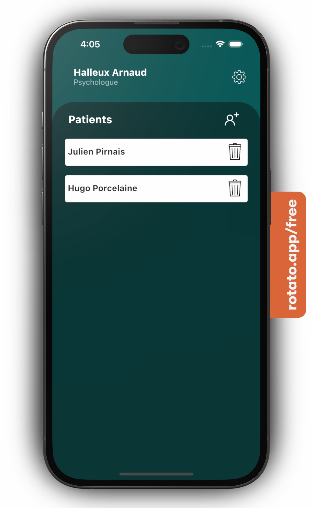
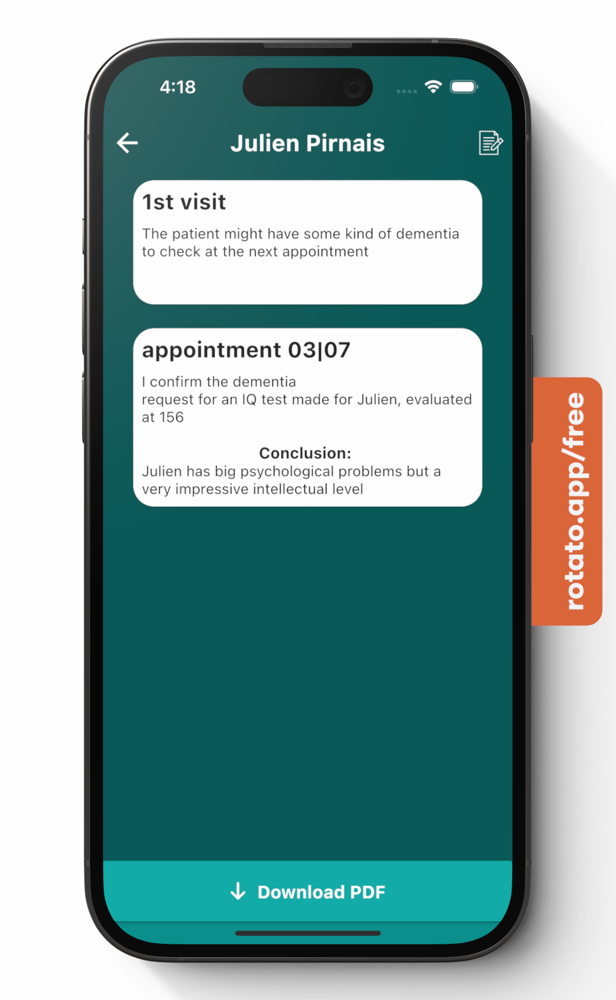
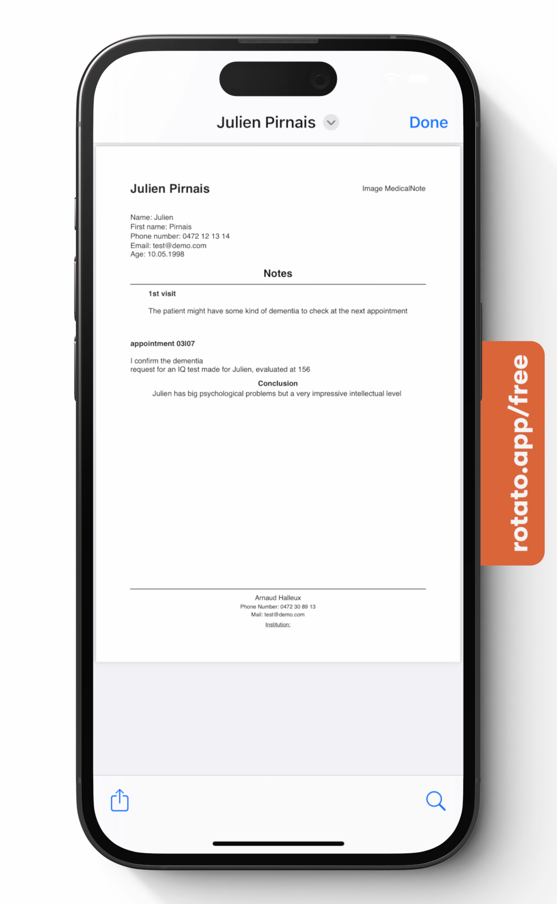

<!-- PROJECT LOGO -->
<br />
<div align="center">
  <a href="https://github.com/Buubulle/MedicalNote">
    
  </a>

  <h3 align="center">MedicalNote</h3>

  <p align="center">
    1st 100% local medical note taking application
  </p>
</div>

$~$

$~$

<!-- TABLE OF CONTENTS -->
<details>
  <summary>Table of Contents</summary>
  <ol>
    <li>
      <a href="#about-the-project">About The Project</a>
    </li>
    <li>
      <a href="#getting-started">Getting Started</a>
      <ul>
        <li><a href="#prerequisites">Prerequisites</a></li>
        <li><a href="#installation">Installation</a></li>
      </ul>
    </li>
    <li><a href="#license">License</a></li>
    <li><a href="#contact">Contact</a></li>
  </ol>
</details>

<!-- ABOUT THE PROJECT -->
## About The Project

<br />
<div align="center">
  <a href="https://github.com/Buubulle/MedicalNote">
    
    
    
  </a>
</div>

$~$

I got the idea for this project when my girlfriend kept telling me that she was losing the names of her patients or other very important information, so I designed MédicalNote, the first 100% local note taking and pdf saving application.

What will it bring to your organization:

* Better organization of note taking
* 100% secure as the entire application is based on LocalStorage technology
* free :smile:


Of course, the application is not perfect and is in "Beta" I remind you if you want to make changes I am open to any proposal for improvement you can also create a pull request with your additions / changes I will look at all that 

$~$

<!-- GETTING STARTED -->
## Getting Started

Before you can modify the project, here is an installation tutorial step by step.

### Prerequisites

1. To be able to run the dart code you have to download flutter and add it to your Path for that I advise you to go [here](https://docs.flutter.dev/get-started/install)
2. Install Git [here](https://git-scm.com/downloads)

Don't forget that for the ios build you must be on macos or on a specific VM for the ios build

### Installation

1. Git clone the [Project](https://github.com/Buubulle/MedicalNote) into a specific folder
   ```sh
   git clone https://github.com/Buubulle/MedicalNote.git
   ```
3. Initialize the project
   ```sh
   flutter pub get
   ```
4. Enjoy :smile:

$~$

<!-- LICENSE -->
## License

Distributed under the GPL-3.0 License. See `LICENSE` for more information.

$~$

<!-- CONTACT -->
## Contact

Halleux Arnaud - [Linkedin](https://www.linkedin.com/in/arnaud-halleux-64a061258/) - halleuxarnaudpro@gmail.com

$~$
